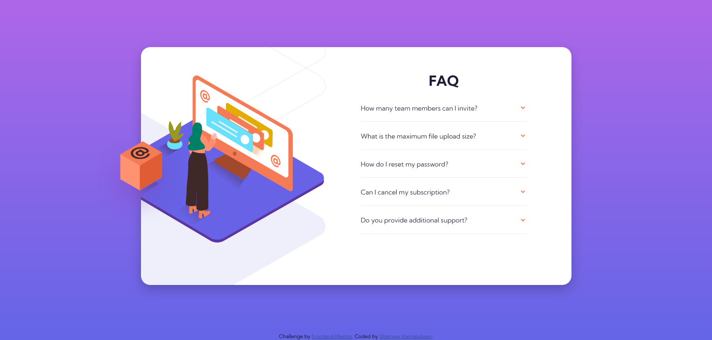

# Frontend Mentor - FAQ accordion card solution

This is a solution to the [FAQ accordion card challenge on Frontend Mentor](https://www.frontendmentor.io/challenges/faq-accordion-card-XlyjD0Oam). Frontend Mentor challenges help you improve your coding skills by building realistic projects. 

## Table of contents

- [Overview](#overview)
  - [The challenge](#the-challenge)
  - [Screenshot](#screenshot)
  - [Links](#links)
- [My process](#my-process)
  - [Built with](#built-with)
  - [What I learned](#what-i-learned)
  - [Continued development](#continued-development)
  - [Useful resources](#useful-resources)
- [Author](#author)
- [Acknowledgments](#acknowledgments)

## Overview

This challenge is so far the most difficult challenge on my learning period of front-end from Frontend Mentor. The challenge mostly faced on placing the elements in a particular location on the exact position as design suggest as well as the design seems developed not based on the ability to achieve using HTML and CSS or made over-complicated things or its completely my perspective as I am just started learning front-end.  

### The challenge

Users should be able to:

- View the optimal layout for the component depending on their device's screen size
- See hover states for all interactive elements on the page
- Hide/Show the answer to a question when the question is clicked

### Screenshot

### Links

- Solution URL: [Click here](https://github.com/shameerkamaludeen/faq-accordion-card)
- Live Site URL: [Click here](https://shameerkamaludeen.github.io/faq-accordion-card/)

## My process

### Built with

- Semantic HTML5 markup
- Flexbox
- Mobile-first workflow

### What I learned

- Started familiarising myself the JavaScript as I used some in this challenge.
- Came to know that transition on an element with some properties are not possible and how to tackle to achieve the same with the help of other properties.
- The accessibility is more important than any design and how difficult it may do not guard down the accessibility for the design.

### Continued development

- Better improvement in transition and animation
- Better imprevement in the javascript

### Useful resources

- [A replacement for the transition on display or visibility property](https://stackoverflow.com/q/3508605/3877538) - This helped me achieve transition on the problem faced while trying to transition using display or visibility property.
- [Center an absolutely positioned element in a div](https://stackoverflow.com/q/1776915/3877538)

## Author

- Github - [Shameer Kamaludeen](https://github.com/shameerkamaludeen)
- Frontend Mentor - [@shameerkamaludeen](https://www.frontendmentor.io/profile/shameerkamaludeen)

## Acknowledgments

With the help of Frontend Mentor, StackOverflow and other similar resources my knowledge of web technologies started to improve a lot, I am really thankful for them.
